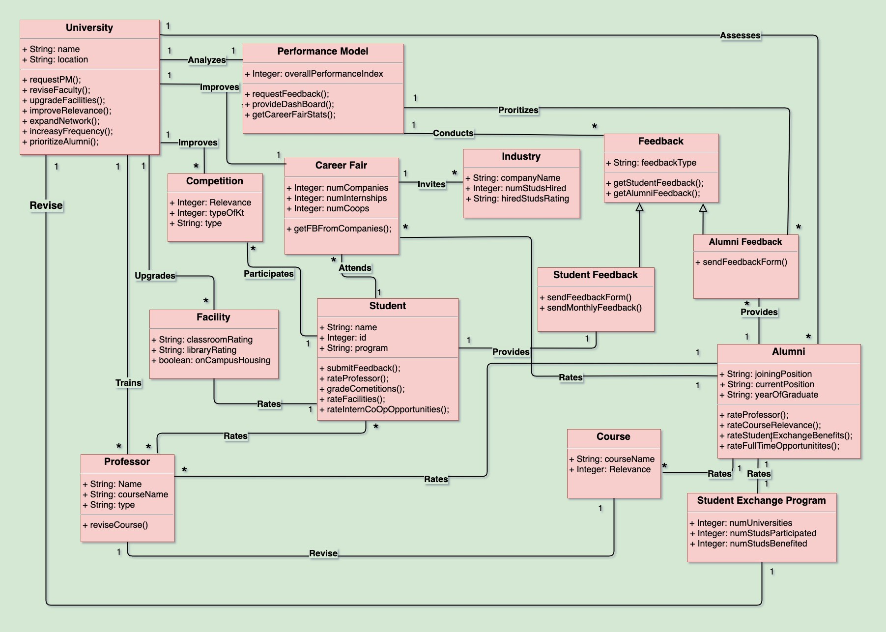
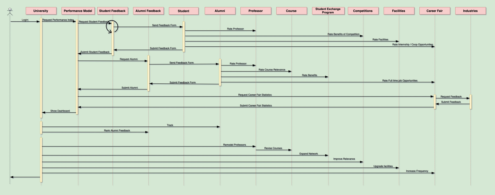
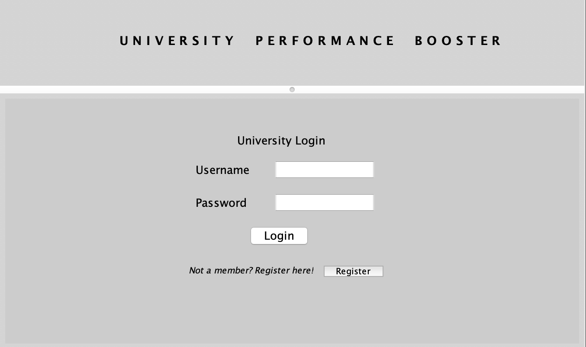
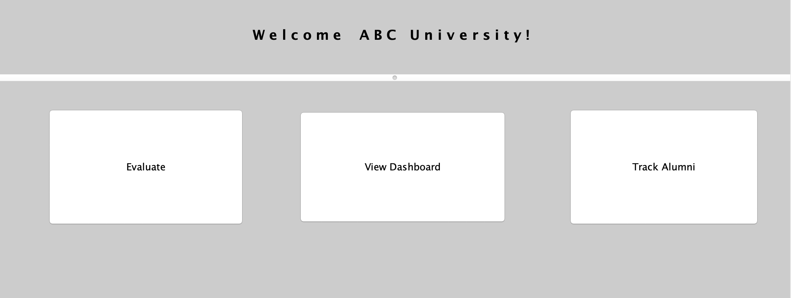
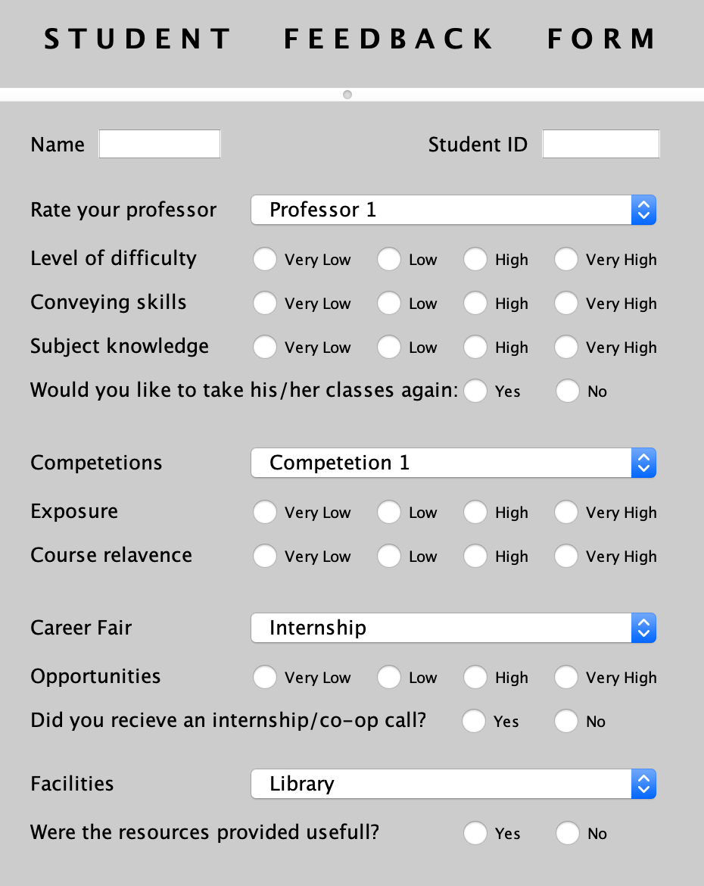
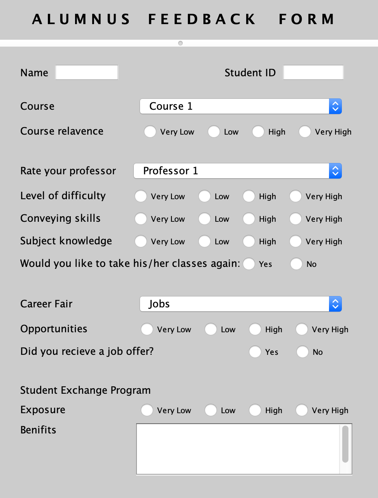
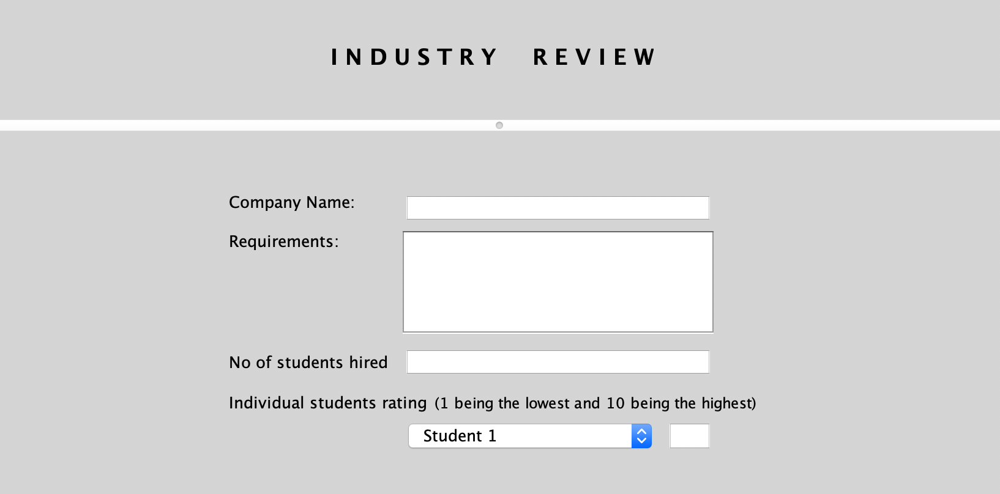
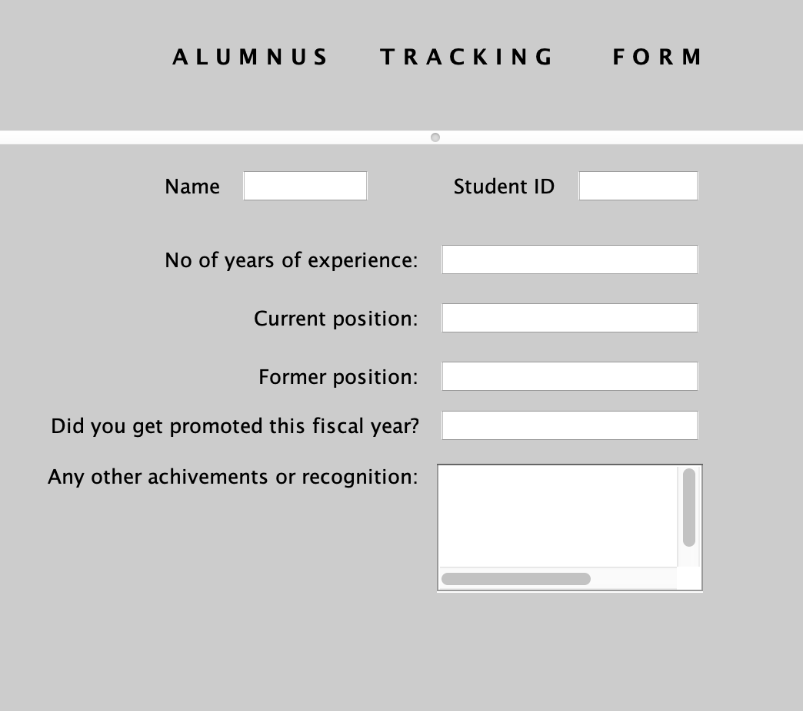
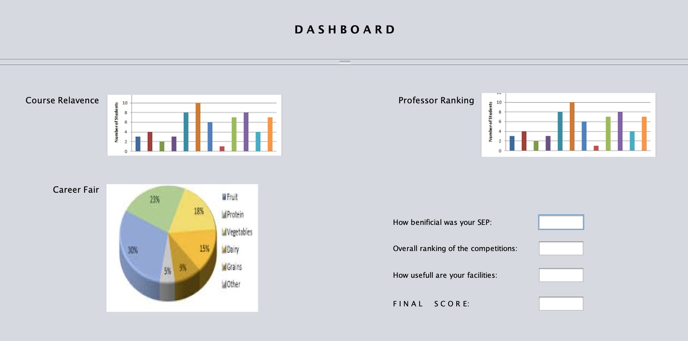
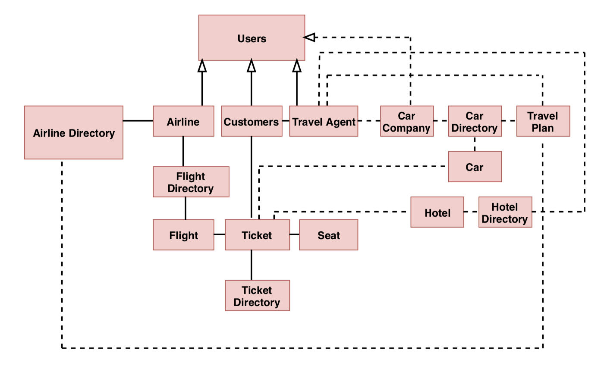

# BitByte&Binary_AEDDesignAssignment

The performance model calculates the Performance Index (PI) which is the current quality of education system using the following formula:PI = (20% * Alumni feedback) + (20% * Course) + (15% * Student review from Industry) +(10% * Career fair) + (10% * Student feedback) + (10% * Professor) + (5% * Competitions) +(3% * SEP) + (2% * Facilities)Based upon the result given by performance model, the University can implement necessary measures in the concerned areas.

## OBJECT MODEL DIAGRAM:

## University
The University model requests the performance index from the performance model from which the university decides to act to improve the quality of education. The feedback received from the students and alumni regarding the facilities of the universities also helps in deciding the performance index of the university. The feedback also helps in deciding the quality of the facilities which can be upgraded by the university. The relevance of the courses can be improved by the university based on the relevance index which is calculated based on feedback from alumni and the companies. The quality of the career fair can also be improved by the university based on the index of the career fair. This quality is decided based on the feedback from students who look for co-op/internship opportunities and alumni (who may have got a full-time job through the career fair). Thus, the university can improve the quality of the career fair by expanding the network and getting in more companies which will help students to get more opportunities in the industry. Course and industry-related competitions also play a vital role in improving the quality of education. The university can decide if more competitions are to be held based on the index of the competitions observed. Alumni of the university can be ranked based on their current job designation and how well they are doing in the industry. Their initial designation and the current designation can be analyzed to decide their growth.

## Alumni
The Alumni of the University is an important factor to consider who helps to rate the educational quality of a university. The alumni have the current industry exposure and can rate the relevance of the course. The alumni can also rate the professor of the courses which were taken and provide feedback. The student exchange programs are also rated by the alumni according to which the university can take necessary action to improve the quality of education. The full-time opportunities of the career fair are also rated by the alumni.

## Student
The student provides monthly feedback wherein the rating of multiple factors which can be considered to improve the quality of education. The student attends classes conducted by the professor and rates him based on the quality of teaching, etc. The competitions conducted by the universities are attended by the student and provides feedback for it. The facilities are used by the student which include libraries, classrooms, etc. The internship/co-op offered in the career fair by the university is also rated by the student based on whether he/she has received a co-op/internship through the university.

## Performance Model
The university requests for the performance index to improve the quality of education. The university acts accordingly to improve it. The Performance Model is a system that considers various factors and comes up with the performance index. It requests for feedback from the students and alumni and handles the information. It provides a dashboard to the admin user which is accessed to check the PI. This model also gets career stats information.

## Career Fair
The career fair helps students to get co-op/full-time job opportunities. It is also responsible to get the feedback from the companies about the students that are hired.
Facility
The facilities include libraries, classrooms, and other factors. Facilities are rated by the current students and alumni. Facilities are directly responsible to affect the quality of education.

## Competition
The course related competitions also help in improving the quality of education. The relevance of these competitions helps in training the students according to the current job market.

## Professor
The professor is rated by the students and the alumni. The professor is also responsible to improve the quality of the course based on the order from the university to improve the quality of education. The university also trains the professor to improve his quality.

## Course
The course is rated according to the relevance to the current job market. The alumni provide this rating in the feedback form which is submitted.

## Industry
Industry class uses three attributes namely companyName, numStudshired & hiredStudsRating which stores Company name, Number of students hired & Rating of each hired student. Based on the last two attributes, the performance model rates the individual career fair of the University.

## Student Feedback Form
Student feedback form class is inherited from the Feedback interface and sends out a feedback form to the current students on a monthly basis. 

## Alumni Feedback Form
Alumni feedback form class is inherited from the Feedback interface and sends out a feedback form to the former students on a monthly basis. 

## Student Exchange Program
Student Exchange Program class takes parameters into account such as the number of Universities a student was sent to, the number of students who participated in the program and the number of students who benefited from the program and calculates the exposure a university can provide to a student.

## SEQUENCE DIAGRAM:

The process of assessment of the existing education system in a University and providing solutions based on results takes place in 5 different stages.
 
1.     For any problem to be addressed a study is required on the existing system. Hence review from the students currently pursuing their graduation plays an important role. The **performance model** requests for **feedback from the students** based on the following parameters. The feedback from the semester can be taken on a monthly basis to immediately address issues if any.
·      Students are asked to rate the **professors** based on subject knowledge, conveying skills and several related parameters.
·      **Competitions** that are staged to the students are responsible for the exposure they get and hence the benefits of competitions are asked to grade.
·      **Internship and coop opportunities** play a major role in giving them an opportunity to interact with industries which is another parameter to be graded.
·      **Facilities** play a trivial role but are equally important to support and encourage the students.

2.     A problem can be better understood better when looked at the perspective of the subjects who have already undergone it. **Alumni feedback** is considered for the same.
·      **Professors** and their respective **courses** are addressed based on experience and relevance level respectively.
·      **Student exchange programs** could be beneficial in several ways of exposure and its effect can be graded.
·      Whether the alumni could acquire a full-time job through the **career fair** is one of the parameters.

3.     Only when a problem is envisioned from different perspectives will there be a clear understanding. Hence performance model, through a **career fair**, requests for feedback from **industries** based on their expectations and performance of hired students.

4.      University keeps track of alumni through a **tracking system**. Tracking systems takes into consideration, their joining position, current position, number of years of experience to check their career growth. Tracking systems function on a periodic basis. Higher the career growth, greater is the importance given to their feedback.

5.     Based on the final results on the dashboard, the University can decide how to increase the quality of education. The measures that can be taken could be to remodel professors, revise the course, expand the network in their student exchange program, introduce relevant competitions, increase the frequency of the career fair and upgrade facilities. 

## USER INTERFACE OF THE PERFORMANCE MODEL APPLICATION

## Login page

This page provides an interface for the universities to login to the application. If they are a new user, they can sign up using Register button.

## Welcome page

In this page, the user can choose either evaluate their PI through three forms i.e. Student Feedback Form, Alumni Feedback Form and Industry Feedback form. Upon clicking on evaluate button, the forms are sent to Student, Alumni and the Companies which come for career fair, and the Performance Index of the university is calculated and can be seen upon clicking Dashboard button. Track alumni button is to track Alumnus status in his/her job, through which the Alumnus feedback form will be ranked.

## Student Feedback Form

This form will be sent out to a current student and the feedback form will contain parameters like Rating the professor, rating the career fairs etc., through which the performance index is eventually calculated.

## Alumnus Feedback Form

This form will be sent out to a former student and the feedback form will contain parameters like Rating the professor, rating the career fairs etc., through which the performance index is eventually calculated.

## Industry Review

This form will be sent out to the companies visited in the career fair and the feedback form will contain parameters like rating the hired students, expectations (requirement), etc., through which the performance index is eventually calculated.

## Alumni Tracking Form

This form will be sent out to the alumnus and the feedback form will contain parameters that track the Alumni progress in their career path.

## Dashboard

The Dashboard takes all the feedback forms into account and provides metrics to rank a particular course, rank a professor, no of students got placed in the internships/co-ops through the career fair etc. Based on all these factors the university is going to take action to improve the quality of its education.
(The graphs shown below is inaccurate because the actual dashboard is displayed through values that are got from the feedback forms)

# Travel Assignment UML diagram for Extending our application.

